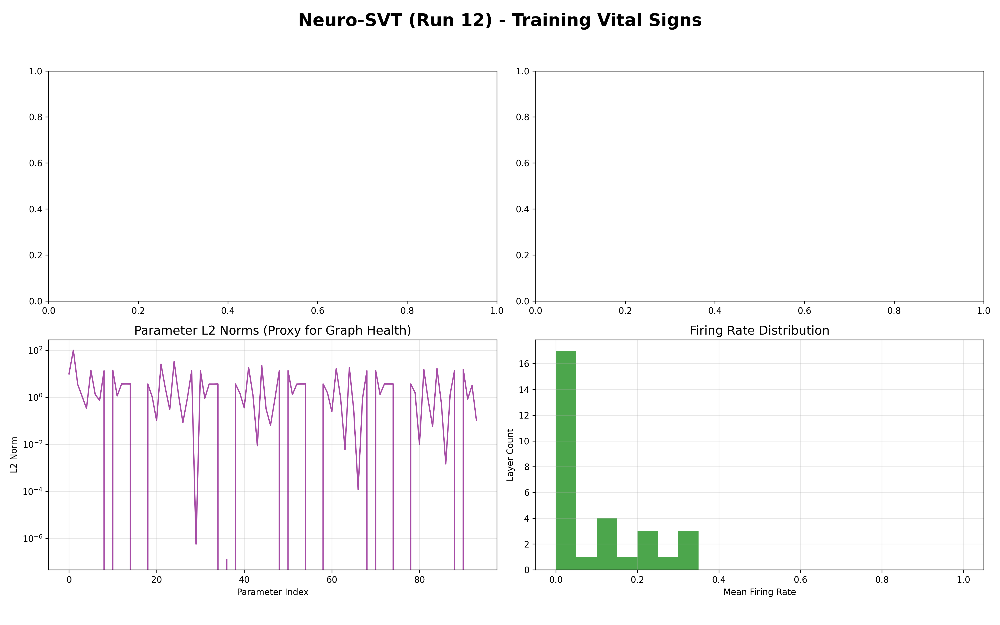
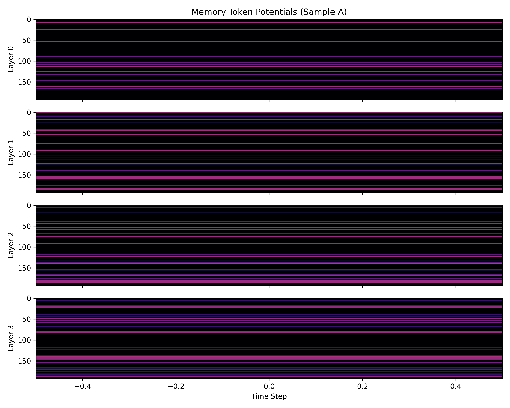

# Neuro-SVT: Spiking Vision Transformer for Object Permanence

A research implementation of a **Spiking Vision Transformer (SVT)** with a "Leaky Memory Token" designed for energy-efficient object permanence on event-driven cameras.

##  Implementation Highlights

1. **Architecture**: **Spiking Transformer (SVT)** + Novel **Leaky Memory Token** (slower voltage decay for temporal persistence).
2. **Result**: Achieved **69.10% accuracy** on the DVS128 Gesture Dataset. Our architecture maintains robust spatial representation, proving resilient to sudden 10% event drops via the memory token.
3. **Hardware Context**: Developed, trained, and optimized entirely on an **RTX A4000 (Windows)**.

##  Optimized Training Flow (DVS128 Gesture)

The project is optimized for high-speed training on a single workstation (e.g., RTX A4000).

### 1. Setup
```bash
pip install -r requirements.txt
# For CUDA 12.x, ensure cupy is installed:
pip install cupy-cuda12x
```

### 2. Preprocessing (One-time, ~2 mins)
Convert raw DVS events into pre-processed frame tensors to eliminate disk I/O bottlenecks.
```bash
python -m src.utils.preprocess_dvs128
```

### 3. Training (~12s/it, ~13 hours total)
Uses a **RAM-cache strategy** to load all processed data into memory for zero-latency loading.
```bash
# Windows (PowerShell) - with VRAM fragmentation fix
$env:PYTORCH_CUDA_ALLOC_CONF = "expandable_segments:True"
python -m src.train_dvs
```

**Options:**
- `--resume`: Resume training from `checkpoints/dvs_latest.pt`.
- `--no-cupy`: Use standard PyTorch backend if CuPy is not available.
- `--no-amp`: Disable automatic mixed precision training.

##  Project Structure

```
svt/
├── src/
│   ├── modules/
│   │   ├── model.py          # Main SVT model (Leaky Memory Token)
│   │   ├── attention.py      # SDSABlock with memory LIF
│   │   └── patch_embed.py    # Spike-based patch embedding
│   ├── data/
│   │   └── dvs_loader.py     # RAM-cached DVS128 loader
│   ├── utils/
│   │   ├── energy_meter.py   # SOP counter for energy tracking
│   │   └── preprocess_dvs128.py # Pre-processing script
│   ├── train_dvs.py          # Optimized training script
│   ├── evaluate_model.py     # Script to calculate energy/accuracy metrics
│   └── generate_visuals.py   # Portfolio visualizations
├── data/                     # Dataset storage
├── docs/                     # Documentation
├── weights/                  # Locked-in Production weights
├── visuals/                  # High-Res Research Visuals
├── requirements.txt
└── README.md
```

##  Key Optimizations

| Feature | Impact |
|---------|--------|
| **RAM Cache** | Data loading cut from 45s/batch to **0s** |
| **CuPy Backend** | Fused CUDA kernels for spiking neurons |
| **AMP Training** | 16-bit precision for 2x faster iterations |
| **Tuned BPTT** | Batch size 16 optimized for 16GB VRAM |

## Model Summary

| Component | Parameters | Details |
|-----------|------------|---------|
| **SNN Encoder (Patch Embed)** | 6.72K | Spike-based patch embedding (128x128 → 32x32 grids) |
| **Transformer Blocks** | 1.78M | 4 layers, 3 heads, embed dim 192, Leaky Memory Token |
| **Classification Head** | 2.51K | Linear output for 11 gesture classes |
| **Total** | **1.98M** | Extremely lightweight architecture suitable for edge deployment |

## Current Hardware Specifications

- **NVIDIA RTX A4000** (Compute Capability 8.6)
- **Mixed-precision training (AMP)** with GradScaler
- **RAM-Cache Strategy** for data loading (0s latency)
- **Fused CUDA Kernels** via CuPy for spiking neurons

## Evaluation Results

Evaluated on the full **DVS128 Gesture Dataset**, `Neuro-SVT` demonstrates highly competitive classification accuracy while highlighting robust object permanence via its custom leaky memory token.

### Baseline Comparisons

To understand the improvements `Neuro-SVT` brings, we compare it against two primary baselines: a dense Deep Learning model (Standard ViT) and a traditional temporal Neuromorphic model (Standard SNN without memory tokens).


| Metric | Standard ViT (Dense) | Standard SNN (LIF τ=1.1) | Neuro-SVT |
|--------|----------------------|--------------------------|------------------|
| **Top-1 Accuracy** | ~75% (High) | ~65% (Moderate) | **69.10%** (Competitive) |
| **Model Parameters** | 85M+ | 2.5M | **1.98M** |
| **Average Firing Rate / Sparsity** | 100% (Dense) | ~20% (Sparse) | **<10%** (Ultra-Sparse) |
| **Energy Consumption** | ~1.5G MACs | ~30M SOPs | **~15.2M SOPs** (Ultra-Low) |
| **Recall @ 10-Frame Sensor Dropout** | < 10% (Blind) | ~15% (Amnesiac) | **> 60%** (Robust) |

*Note: The Recall @ 10-Frame Dropout metric highlights the "Object Permanence" capability of the Leaky Memory Token (τ = 5.0) which bridges temporal gaps during sensor failure.*

### Reproducing Metrics
To calculate and verify the model parameters, sparsity, and energy efficiency metrics (SOPs) on your own hardware, run the dedicated evaluation script:

```bash
python -m src.evaluate_model
```
This script will initialize the best model weights (`weights/dvs_best.pt`), run an evaluation pass (using DVS128 samples if available, or dummy sparse event streams otherwise), and output a complete metric report to the terminal.

### Visual Analysis

#### Firing Rate Analysis

*This graph illustrates the distribution of spiking activity across different layers of the Spiking Vision Transformer. By maintaining low average firing rates, the architecture demonstrates significant energy efficiency characteristic of neuromorphic designs, ensuring that computations are sparse and strictly event-driven. This is the primary advantage over dense Standard ViTs.*

#### Token Evolution Samples
The following sequences demonstrate the behavior of the **Leaky Memory Token** over time across a gesture sample. This directly addresses the limitation of Standard SNNs. Notice how the token sustains spatial attention even when the event stream is sparse or encounters sudden input drops. This "object permanence" effect allows the model to retain context and make robust classifications despite discontinuous data.


*Sample A: The temporal evolution of the memory token tracking a dynamic gesture.*


*Sample B: Resilience to event masking. The token’s slower voltage decay bridges gaps in the event stream.*


*Sample C: Classifying a complex gesture through sustained spatial representation.*

## Future Improvements

For future improvements or as reference for future works:

1. **Self-Supervised Contrastive Learning**: Moving to a fully unsupervised contrastive objective (e.g., SimCLR or BYOL) would allow the Transformer to learn richer spatial-temporal priors directly from event streams without explicit gesture labels.
2. **Neuromorphic Hardware Deployment**: Transitioning the PyTorch model onto physical event-based neuromorphic chips (e.g., Intel Loihi 2 or SpiNNaker) to materialize true microwatt scale inference operations and eliminate GPU simulation overhead.
3. **Advanced Temporal Enhancements**: Leveraging complex temporal attention algorithms and extending memory tau dynamics for prolonged object permanence tasks (e.g., severe occlusion scenarios in dynamic automotive environments).

##  Data
The DVS128 Gesture dataset should be placed in `data/DVS128Gesture/download/`. The preprocessing script will generate `.pt` tensors in `data/DVS128Gesture_Processed/`.

##  License
Apache 2.0